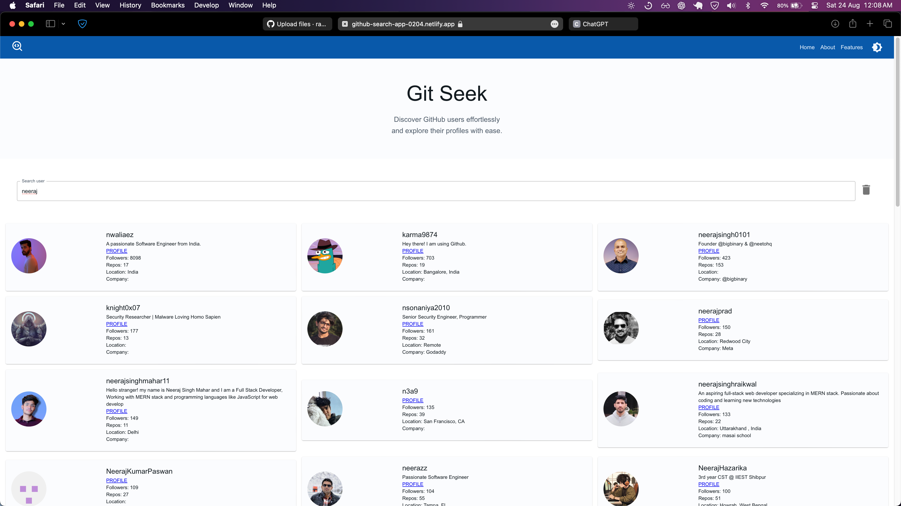

# GitSeek - Github User Search App 🔎

A minimalist web application built with React.js and the MERN stack to search for GitHub users by their username.



## Demo

You can check out the live demo - [GitSeek](https://github-search-app-0204.netlify.app)

## Overview

GitSeek is a web application that allows users to search for GitHub users by entering their usernames. The app leverages the GitHub API to fetch user details and displays the results in a clean and minimalist interface.

## Features

### Frontend (React.js)
- **Real-time Search**: Users can see search results as they type, providing an immediate and dynamic experience.
- **Dark Theme**: The interface features a sleek dark theme, ensuring a modern and user-friendly design.
- **Clear Button**: A reset button allows users to quickly clear their search input.
- **Error Handling**: Displays appropriate error messages in case of API rate limits or other issues.
- **Followers Count**: Shows the number of followers for each GitHub user.

### Backend (Express.js)
- **GitHub API Integration**: Efficiently fetches user data using GitHub's API, ensuring accurate and up-to-date information.
- **Rate Limiting**: Implements mechanisms to handle API rate limits gracefully.
- **Error Handling**: Provides robust error handling to ensure smooth user experience during API call failures.

## Deployment
The app is deployed on [netlify](https://github-search-app-0204.netlify.app), making it easily accessible online.

## 🎯 How to Use

  1.  Enter a GitHub username in the search bar.
  2.  View real-time search results as you type.
  3.  Click on a user from the results to view more details.

## 🛠 Technologies Used

  • Frontend: React.js, Material-UI
  • Backend: Express.js, Node.js
  • Database: MongoDB
  • API: GitHub API
  • Deployment: [Your deployment service]

## Getting Started

### Prerequisites

### Prerequisites
- Node.js
- npm or yarn
- MongoDB (for backend)

### Installation

1. Clone the repository:

   ```bash
   git clone https://github.com/your-username/github-user-search-app.git 
   ```

2. Navigate to the project directory:

  `cd github-user-search-app`

3. Install dependencies:

  `npm install`

## Usage

1.  Run the application:

  `npm start`

2. Open your browser and go to http://localhost:3000.
3. Enter a GitHub username in the search bar to see the results.


## API Configuration

To configure the GitHub API access, update the `GITHUB_TOKEN` variable in the **server.js**, **app.js** file with your GitHub token.`

## Contributing

Contributions are welcome! Feel free to submit issues or pull requests.
